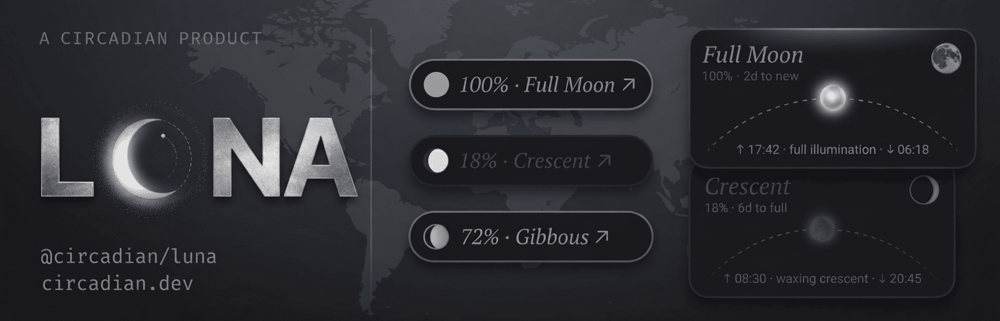

<div align="center">



<br />
<br />

<a href="https://www.npmjs.com/package/@circadian/luna">
  
</a>
<a href="https://www.npmjs.com/package/@circadian/luna">
  
</a>
<a href="https://github.com/circadian-dev/luna/blob/main/LICENSE">
  
</a>
<a href="https://github.com/circadian-dev/luna/actions/workflows/validate.yml">
  
</a>

<br />
<br />

**Lunar-aware React widgets that follow the real phase of the moon.**

[npm](https://www.npmjs.com/package/@circadian/luna) · [GitHub](https://github.com/circadian-dev/luna) · [circadian.dev](https://circadian.dev)

</div>

---

> **Sol follows the sun. Luna follows the moon.**

Most UIs stop at light mode and dark mode. Sol pushed that further — an interface that reacts to the real position of the sun. Luna is the other half of that story.

Luna computes the moon's real phase, illumination, and arc position from the user's location and current time, then transitions the interface through **8 lunar phases** — new, waxing crescent, first quarter, waxing gibbous, full, waning gibbous, last quarter, and waning crescent — with smooth blends, arc-tracking orbs, and 10 richly designed skins.

No API key. No manual toggle. Your UI just follows the moon.

Luna is the companion package to [`@circadian/sol`](https://www.npmjs.com/package/@circadian/sol), and the foundation for the upcoming `@circadian/ambient` — a unified layer that morphs between Sol and Luna as the sun sets and rises.

---

```bash
bun add @circadian/luna
# or
npm install @circadian/luna
# or (Deno / Fresh)
deno add npm:@circadian/luna
```

`@circadian/luna` gives you a full `LunaWidget`, a `CompactLunaWidget`, 10 skins, 8 lunar phases, and a dev-only phase + arc scrubber via `LunaDevTools`. Lunar position is computed locally from latitude, longitude, timezone, and current time using Meeus astronomical algorithms — no external API required.

---

## Features

- **2 widget variants** — `LunaWidget` (full card) and `CompactLunaWidget` (slim pill/bar)
- **10 skins** — `foundry`, `paper`, `signal`, `meridian`, `mineral`, `aurora`, `tide`, `void`, `sundial`, `parchment`
- **8 lunar phases** — `new`, `waxing-crescent`, `first-quarter`, `waxing-gibbous`, `full`, `waning-gibbous`, `last-quarter`, `waning-crescent`
- **Real moon tracking** — orb follows the moon's arc from moonrise → zenith → moonset
- **Illumination display** — real-time percentage (0% new moon → 100% full moon)
- **Moonrise/moonset times** — computed locally, no API
- **Built-in fallback strategy** — geolocation → browser timezone → timezone centroid
- **Dev preview tooling** — `LunaDevTools` lets you pick phases and scrub the arc position
- **SSR-safe** — works in Next.js, Remix, TanStack Start, Blade, Fresh, and Vite

---

## Quick Start

Luna uses browser APIs for geolocation and lunar computation. The exact setup depends on your framework — pick yours below.

---

### Vite

No special setup needed. Wrap your app with the provider and use widgets directly.

```tsx
// main.tsx
import { StrictMode } from 'react';
import { createRoot } from 'react-dom/client';
import { LunaThemeProvider } from '@circadian/luna';
import App from './App';

createRoot(document.getElementById('root')!).render(
  <StrictMode>
    <LunaThemeProvider initialDesign="void">
      <App />
    </LunaThemeProvider>
  </StrictMode>,
);
```

```tsx
// App.tsx
import { LunaWidget } from '@circadian/luna';

export default function App() {
  return <LunaWidget showIllumination showMoonrise />;
}
```

---

### Next.js (App Router)

Add `'use client'` at the top of any file that uses Luna. This marks it as a client component and prevents it from running during server rendering.

```tsx
// components/providers.tsx
'use client';
import { LunaThemeProvider } from '@circadian/luna';

export default function Providers({ children }: { children: React.ReactNode }) {
  return (
    <LunaThemeProvider initialDesign="void">
      {children}
    </LunaThemeProvider>
  );
}
```

```tsx
// components/luna-widget.tsx
'use client';
import { LunaWidget } from '@circadian/luna';

export default function Luna() {
  return <LunaWidget showIllumination showMoonrise />;
}
```

```tsx
// app/layout.tsx
import Providers from '../components/providers';

export default function RootLayout({ children }: { children: React.ReactNode }) {
  return (
    <html lang="en">
      <body>
        <Providers>{children}</Providers>
      </body>
    </html>
  );
}
```

```tsx
// app/page.tsx
import Luna from '../components/luna-widget';

export default function Page() {
  return <Luna />;
}
```

---

### Remix

Name any file that uses Luna with a `.client.tsx` extension. Remix excludes `.client` files from the server bundle automatically.

```tsx
// app/components/providers.client.tsx
import { LunaThemeProvider } from '@circadian/luna';

export default function Providers({ children }: { children: React.ReactNode }) {
  return (
    <LunaThemeProvider initialDesign="void">
      {children}
    </LunaThemeProvider>
  );
}
```

```tsx
// app/components/luna-widget.client.tsx
import { LunaWidget } from '@circadian/luna';

export default function Luna() {
  return <LunaWidget showIllumination showMoonrise />;
}
```

```tsx
// app/root.tsx
import Providers from './components/providers.client';

export default function App() {
  return (
    <html lang="en">
      <body>
        <Providers>
          <Outlet />
        </Providers>
      </body>
    </html>
  );
}
```

```tsx
// app/routes/_index.tsx
import Luna from '../components/luna-widget.client';

export default function Index() {
  return <Luna />;
}
```

---

### TanStack Start

Use the `ClientOnly` component from `@tanstack/react-router` to prevent Luna from rendering during SSR.

```tsx
// app/components/luna-widget.tsx
import { ClientOnly } from '@tanstack/react-router';
import { LunaThemeProvider, LunaWidget } from '@circadian/luna';

export default function Luna() {
  return (
    <ClientOnly fallback={null}>
      <LunaThemeProvider initialDesign="void">
        <LunaWidget showIllumination showMoonrise />
      </LunaThemeProvider>
    </ClientOnly>
  );
}
```

```tsx
// app/routes/index.tsx
import Luna from '../components/luna-widget';

export const Route = createFileRoute('/')({
  component: () => <Luna />,
});
```

---

### Blade

Name any file that uses Luna with a `.client.tsx` extension. Blade runs pages server-side; component files run client-side.

```tsx
// components/providers.client.tsx
import { LunaThemeProvider } from '@circadian/luna';

export default function Providers({ children }: { children: React.ReactNode }) {
  return (
    <LunaThemeProvider initialDesign="void">
      {children}
    </LunaThemeProvider>
  );
}
```

```tsx
// components/luna-widget.client.tsx
import { LunaWidget } from '@circadian/luna';

export default function Luna() {
  return <LunaWidget showIllumination showMoonrise />;
}
```

```tsx
// pages/layout.tsx
import Providers from '../components/providers.client';

export default function RootLayout({ children }: { children: React.ReactNode }) {
  return <Providers>{children}</Providers>;
}
```

```tsx
// pages/index.tsx
import Luna from '../components/luna-widget.client';

export default function Page() {
  return <Luna />;
}
```

---

### Fresh (v2)

Fresh uses Preact, so Luna works via `preact/compat`. Add the React compatibility aliases to your `vite.config.ts` and `deno.json`, then create an [island](https://fresh.deno.dev/docs/concepts/islands) for the widget.

**1. Install**

```bash
deno add npm:@circadian/luna
```

**2. Configure Vite aliases** — add `resolve.alias` to `vite.config.ts`:

```ts
// vite.config.ts
import { defineConfig } from "vite";
import { fresh } from "@fresh/plugin-vite";

export default defineConfig({
  plugins: [fresh()],
  resolve: {
    alias: {
      "react": "preact/compat",
      "react-dom": "preact/compat",
      "react/jsx-runtime": "preact/jsx-runtime",
      "react/jsx-dev-runtime": "preact/jsx-runtime",
      "react-dom/client": "preact/compat/client",
    },
  },
});
```

**3. Add import map entries** — add to the `"imports"` in `deno.json`:

```jsonc
// deno.json (imports section)
{
  "imports": {
    "react": "npm:preact@^10.27.2/compat",
    "react-dom": "npm:preact@^10.27.2/compat",
    "react/jsx-runtime": "npm:preact@^10.27.2/jsx-runtime",
    "react-dom/client": "npm:preact@^10.27.2/compat/client"
  }
}
```

**4. Create an island** — islands are client-hydrated in Fresh, which is what Luna needs:

```tsx
// islands/LunaWidget.tsx
import { LunaThemeProvider, LunaWidget } from '@circadian/luna';

export default function LunaIsland() {
  return (
    <LunaThemeProvider initialDesign="void">
      <LunaWidget showIllumination showMoonrise />
    </LunaThemeProvider>
  );
}
```

**5. Use it in a route:**

```tsx
// routes/index.tsx
import { define } from "../utils.ts";
import LunaIsland from "../islands/LunaWidget.tsx";

export default define.page(function Home() {
  return <LunaIsland />;
});
```

---

## Provider Props

`LunaThemeProvider` is the shared runtime for lunar phase computation, timezone, coordinates, and skin selection.

| Prop | Type | Default | Description |
|---|---|---|---|
| `children` | `ReactNode` | — | Required |
| `initialDesign` | `DesignMode` | `'void'` | Starting skin |
| `latitude` | `number \| null` | — | Override latitude |
| `longitude` | `number \| null` | — | Override longitude |
| `timezone` | `string \| null` | — | Override timezone |

### Location is automatic

`LunaThemeProvider` resolves the user's location using the same 3-step fallback as Sol:

1. **Browser Geolocation API** — most accurate, requires user permission
2. **Browser timezone** (`Intl.DateTimeFormat`) — instant, no permission needed
3. **Timezone centroid lookup** — maps the IANA timezone to approximate coordinates

Lunar phases and moonrise/moonset times are computed locally using Meeus astronomical algorithms — no external API required.

---

## LunaWidget

The full card widget. Reads its design from the nearest `LunaThemeProvider`.

```tsx
<LunaWidget
  expandDirection="top-left"
  size="lg"
  showIllumination
  showMoonrise
/>
```

### Props

| Prop | Type | Default | Description |
|---|---|---|---|
| `expandDirection` | `LunaExpandDirection` | `'bottom-right'` | Direction the card expands |
| `size` | `LunaWidgetSize` | `'lg'` | Widget size (`xs`, `sm`, `md`, `lg`, `xl`) |
| `showIllumination` | `boolean` | `true` | Show illumination percentage |
| `showMoonrise` | `boolean` | `true` | Show moonrise/moonset times |
| `simulatedDate` | `Date` | — | Simulate a specific time |
| `forceExpanded` | `boolean` | — | Lock expanded or collapsed state |
| `hoverEffect` | `boolean` | `false` | Enable hover animation |
| `className` | `string` | — | Wrapper CSS class |

---

## CompactLunaWidget

<div align="center">
 
</div>

The slim pill/bar variant. Always uses the provider's active skin.

```tsx
<CompactLunaWidget
  size="md"
  showIllumination
  showMoonrise
/>
```

### Props

| Prop | Type | Default | Description |
|---|---|---|---|
| `size` | `CompactLunaSize` | `'md'` | Compact size (`sm`, `md`, `lg`) |
| `showIllumination` | `boolean` | `true` | Show illumination percentage |
| `showMoonrise` | `boolean` | `true` | Show moonrise/moonset times |
| `simulatedDate` | `Date` | — | Simulate a time |
| `className` | `string` | — | Wrapper CSS class |

---

## Skins

10 designs, each with a full widget and compact variant. Luna shares the same skin names as Sol — when used together in `@circadian/ambient`, both widgets use the same active skin.

```ts
type DesignMode =
  | 'aurora'      // luminous ethereal
  | 'foundry'     // cold steel by moonlight
  | 'tide'        // fluid organic wave
  | 'void'        // minimal negative space
  | 'mineral'     // faceted crystal gem
  | 'meridian'    // hairline geometric
  | 'signal'      // pixel/blocky lo-fi
  | 'paper'       // silver ink on dark stock
  | 'sundial'     // classical carved latin
  | 'parchment';  // manuscript illustrated
```

---

## LunaDevTools

When your interface depends on the live moon, manual testing is impossible — you can't wait two weeks for a full moon. `LunaDevTools` gives you two independent controls: a **phase picker** (8 lunar phases) and an **arc slider** (moonrise → zenith → moonset), so you can preview every phase and every orb position instantly.

Imported from a dedicated subpath — never included in production bundles unless explicitly imported.

```tsx
import { LunaDevTools } from '@circadian/luna/devtools';

// Vite
{import.meta.env.DEV && <LunaDevTools />}

// Next.js / Remix / TanStack Start / Blade
{process.env.NODE_ENV === 'development' && <LunaDevTools />}
```

### Full example

```tsx
import { LunaThemeProvider, LunaWidget } from '@circadian/luna';
import { LunaDevTools } from '@circadian/luna/devtools';

export default function Demo() {
  return (
    <LunaThemeProvider initialDesign="void">
      <LunaWidget showIllumination showMoonrise />
      {process.env.NODE_ENV === 'development' && (
        <LunaDevTools position="bottom-center" />
      )}
    </LunaThemeProvider>
  );
}
```

### Props

| Prop | Type | Default | Description |
|---|---|---|---|
| `defaultOpen` | `boolean` | `false` | Start expanded |
| `position` | `'bottom-left' \| 'bottom-center' \| 'bottom-right'` | `'bottom-left'` | Panel position |
| `enabled` | `boolean` | `true` | Programmatic enable/disable |

---

## useLunaTheme

```tsx
import { useLunaTheme } from '@circadian/luna';

function DebugPanel() {
  const { phase, illumination, moonProgress, isVisible, design } = useLunaTheme();
  return (
    <pre>{JSON.stringify({ phase, illumination, moonProgress, isVisible, design }, null, 2)}</pre>
  );
}
```

### Return shape

| Property | Type | Description |
|---|---|---|
| `phase` | `LunarPhase` | Current lunar phase |
| `illumination` | `number` | 0–1 illumination (0 = new, 1 = full) |
| `ageInDays` | `number` | 0–29.53 days into the lunar cycle |
| `daysUntilFull` | `number` | Days until next full moon |
| `daysUntilNew` | `number` | Days until next new moon |
| `moonriseMinutes` | `number \| null` | Moonrise in minutes from midnight |
| `moonsetMinutes` | `number \| null` | Moonset in minutes from midnight |
| `moonProgress` | `number` | 0–1 arc position (0 = rise, 0.5 = zenith, 1 = set) |
| `isVisible` | `boolean` | Whether the moon is above the horizon |
| `isReady` | `boolean` | Whether lunar data has computed |
| `design` | `DesignMode` | Active skin name |
| `activeSkin` | `LunaSkinDefinition` | Full skin definition object |
| `accentColor` | `string` | Active accent hex |
| `setDesign` | `(skin: DesignMode) => void` | Change active skin |
| `setOverridePhase` | `(phase \| null) => void` | Set/clear phase override |
| `setSimulatedDate` | `(date \| undefined) => void` | Set/clear simulated date |

---

## useLunarPosition

Standalone hook — no provider required. Use this to build your own lunar-aware components.

```tsx
import { useLunarPosition } from '@circadian/luna';

function MoonInfo() {
  const moon = useLunarPosition();

  return (
    <div>
      <p>Phase: {moon.phase}</p>
      <p>Illumination: {Math.round(moon.illumination * 100)}%</p>
      <p>Visible: {moon.isVisible ? 'Yes' : 'No'}</p>
    </div>
  );
}
```

### Options

| Option | Type | Default | Description |
|---|---|---|---|
| `latitude` | `number \| null` | `51.5074` | Latitude |
| `longitude` | `number \| null` | `-0.1278` | Longitude |
| `timezone` | `string \| null` | `'Europe/London'` | IANA timezone |
| `updateIntervalMs` | `number` | `60000` | Update interval in ms |
| `simulatedDate` | `Date` | — | Override current time |

---

## Multiple Widgets

```tsx
<LunaThemeProvider initialDesign="void">
  <LunaWidget showIllumination />
  <CompactLunaWidget />
  <LunaWidget showMoonrise />
</LunaThemeProvider>
```

The provider manages shared lunar state — location, phase, and position are computed once and shared across all children.

---

## TypeScript

```ts
import type {
  LunarPhase,
  LunarPosition,
  LunaThemeContext,
  LunaSkinDefinition,
  LunarPalette,
  LunarSkinPalettes,
  LunaWidgetProps,
  LunaExpandDirection,
  LunaWidgetSize,
  CompactLunaWidgetPublicProps,
  CompactLunaSize,
} from '@circadian/luna';
```

---

## What's Included

| | |
|---|---|
| ✅ | Full widget + compact widget |
| ✅ | 10 skins with full + compact variants |
| ✅ | Lunar math (Meeus algorithms, no external API) |
| ✅ | Real moonrise/moonset computation |
| ✅ | Moon arc tracking (rise → zenith → set) |
| ✅ | Illumination percentage |
| ✅ | Timezone fallback logic |
| ✅ | Dev phase + arc scrubber |
| ✅ | Self-contained CSS (no Tailwind required in host app) |
| ✅ | SSR-safe (Next.js, Remix, TanStack Start, Blade, Fresh, Vite) |
| ❌ | No API key needed |
| ❌ | No Tailwind needed in your app |
| ❌ | No geolocation permission required |

---

## Coming Soon

Luna is the second piece of the Circadian platform. Next up:

- **`@circadian/ambient`** — a unified layer that morphs between Sol and Luna automatically as the sun sets and rises, with crossfade transitions and synced skin selection
- More skins
- Vue and Svelte adapters

---

<div align="center">

MIT © [Circadian](https://circadian.dev)

</div>
